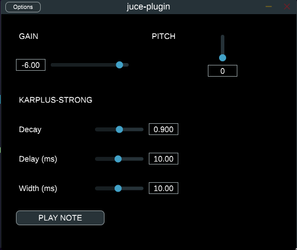

# Ethan's Juce Plugin

This is a simple JUCE plugin that implements gain + pitch shifting on input audio, as well as the Karplus-Strong algorithm to generate string-like sounds.

Please note that this plugin was only tested on Linux.

## Video Demo

For a complete video demo of the plugin's functionality, check out this [YouTube Video](https://youtu.be/gooAiAAbS5M):

[https://youtu.be/gooAiAAbS5M](https://youtu.be/gooAiAAbS5M)
